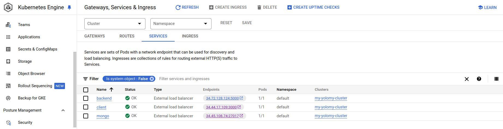

# Using Google Cloud GKE to Deploy the Yolomy eCommerce Website

This guide provides step-by-step instructions on how to launch a Google Kubernetes Engine (GKE) cluster using Google Cloud, and then use `kubectl` to deploy the Yolomy eCommerce website.

## Table of Contents

1. Prerequisites
2. Set Up Google Cloud SDK 
3. Create a GKE Cluster
4. Connect to the GKE Cluster
5. Deploy Yolomy eCommerce Website
6. Accessing the Yolomy Application
7. Cleaning Up

## Prerequisites
Before you begin, ensure you have the following:
-   A Google Cloud account. You can sign up for a free trial [here](https://cloud.google.com/free).
-   **Google Cloud SDK** installed on your machine. Follow [this guide](https://cloud.google.com/sdk/docs/install) for installation instructions.
-   Enable the Kubernetes Engine API in the Google Cloud Console.

## Set Up Google Cloud SDK

1.  **Authenticate with Google Cloud**:  
    Open a terminal and run:
    
	    gcloud auth login` 
    
2.  **Set Your Project**:  
    Set the project in which you want to create the GKE cluster:
    
	    gcloud config set project YOUR_PROJECT_ID` 
    
    Replace `YOUR_PROJECT_ID` with your actual Google Cloud project ID.
    

## Create a GKE Cluster

1.  **Create the GKE Cluster**:  
    Use the following command to create a GKE cluster:
    
	    gcloud container clusters create yolomy-cluster --num-nodes=3 --zone=us-central1-a` 
    
    Adjust the `--zone` flag based on your preferred region.
    
2.  **Wait for the Cluster to be Created**:  
    This process may take several minutes. Once completed, you'll see a confirmation message.
    

## Connect to the GKE Cluster

1.  **Get Credentials for the Cluster**:  
    Run the following command to configure `kubectl` to use your new cluster:
    
	    gcloud container clusters get-credentials yolomy-cluster --zone=us-central1-a` 
    
2.  **Verify Connection**:  
    Check if you can communicate with your cluster:
    
	    kubectl get nodes` 
    
    You should see a list of nodes in your GKE cluster.
    

## Deploy Yolomy eCommerce Website

1.  **Create a Namespace (Optional)**:  
    You can deploy the application in a specific namespace:
    
	    kubectl create namespace yolomy` 
    
2.  **Create Deployment and Service**:  
    Use the earlier provided `deployment.yaml` and `service.yaml` files. Save them in a directory, then apply them:
    
	    kubectl apply -f deployment.yaml --namespace yolomy
	    kubectl apply -f service.yaml --namespace yolomy` 
    
    Sample deployment.yaml
	
		apiVersion: apps/v1
		kind: Deployment
		metadata:
			name: yolomy-deployment
			namespace: yolomy
		spec:
			replicas: 3  #This covers the number of pod replicas you want
            selector:
	    		matchLabels:
                 app: yolomy  #Name should match the NameSpace always for ease
				template:
				 metadata:
					labels:
					    app: yolomy
                spec:
                    containers:
                    - name: yolomy
                    image: docker.io/yolomy/ecommerce:latest # Replace with the correct image for docker image or image from compose.yaml with docker compose up
                    ports:
                    - containerPort: 80
					env: #Hint: to help you with the connection to database
					- name: DATABASE_URL
					  value: "mongodb://mongo:27017/yolomy" # Adjust based on your setup
					- name: NODE_ENV
						value: "production"
		---
		apiVersion: v1
		kind: Service
		metadata:
			name: yolomy-service
			namespace: yolomy #Similar to the namespace in the deployment
		spec:
			type: NodePort/LoadBalancer
			selector:
				app: yolomy
				ports:
				- port: 80
					targetPort: 80
					nodePort: 30001 # Choose a port in the range 30000-32767

  

Save these configurations in their respective .yaml files, and then you can apply them using kubectl as mentioned in the previous instructions.

3.  **Check the Deployment**:  
    Verify if the pods are running:
    
	    kubectl get pods --namespace yolomy` 
    

## Accessing the Yolomy Application

1.  **Get the External IP**:  
    If you used a `LoadBalancer` service type instead of `NodePort`, you can get the external IP with:
    
    `kubectl get services --namespace yolomy` 
    
    For a `NodePort`, you would access it via the cluster's external IP and the `nodePort`.
    
2.  **Access the Application**:  
    Open a web browser and navigate to the external IP (or `<GKE_Cluster_IP>:<NodePort>` for `NodePort`) to see the Yolomy eCommerce website.
    

## Cleaning Up

1.  **Delete the GKE Cluster**:  
    Once you are done, you can clean up resources by deleting the GKE cluster:
    
    `gcloud container clusters delete yolomy-cluster --zone=us-central1-a` 
    
2.  **Confirm Deletion**:  
    Follow the prompts to confirm the deletion.

## Conclusion

You have successfully launched a GKE cluster and deployed the Yolomy eCommerce website using `kubectl`. For further customization, refer to GKE and Kubernetes documentation for advanced configurations and features. If you encounter any issues, consider checking the Google Cloud documentation or community forums for assistance.
